# Guía del Instructor — Introducción a Kubernetes

> **Audiencia:** Alumnos con experiencia en Docker y Docker Swarm.  
> **Duración:** ~2 horas.  
> **Enfoque:** Presentar K8s como evolución natural de lo que ya conocen.

---

## 1. Apertura: De Docker a Kubernetes (~10 min)

**Mensaje clave:** "Ya sabéis orquestar contenedores con Swarm. Kubernetes resuelve los mismos problemas, pero a mayor escala y con más control."

Puntos a tratar:
- Kubernetes (K8s) = plataforma open-source de orquestación de contenedores
- Creado por Google (2014), basado en experiencia interna (Borg/Omega)
- Escrito en Go, gestionado por la CNCF
- Estándar de facto en la industria

**Paralelo con Swarm:**
| Docker Swarm | Kubernetes |
|-------------|-----------|
| `docker service create` | `kubectl apply -f deployment.yaml` |
| Stacks (compose) | Helm charts / manifiestos YAML |
| Swarm manager | Control Plane (API Server) |
| Swarm worker | Worker Node |
| Overlay network | CNI plugins (Calico, Flannel, Cilium) |
| Simple, integrado en Docker | Más complejo, más potente |

---

## 2. Conceptos Fundamentales (~15 min)

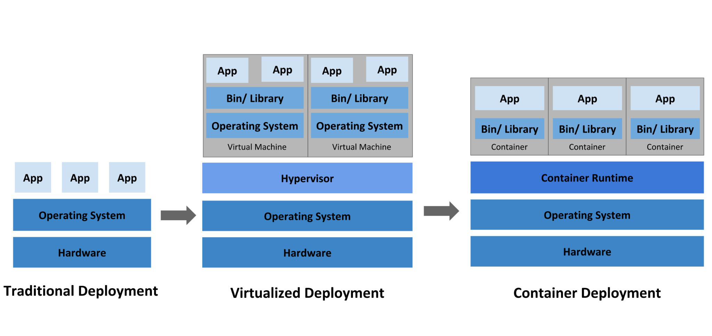

**Qué es un orquestador:**
- Coordina contenedores en múltiples máquinas
- Configuración declarativa (describes QUÉ quieres, no CÓMO)
- Auto-healing, auto-scaling, rolling updates

**Capacidades principales:**
- Flujos de trabajo
- Secretos (K/V)
- Balance de carga
- Panel de control / API
- Automatización
- Almacenamiento

---

## 3. Arquitectura del Clúster (~20 min)

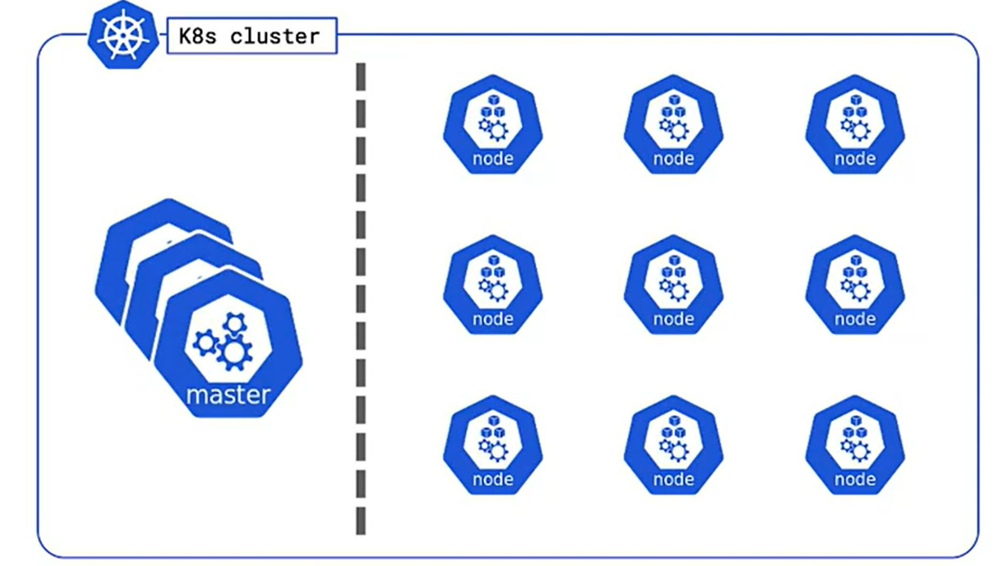

### Control Plane (Master Node)

Equivalente al Swarm Manager, pero más componentes especializados:

| Componente | Función | Equivalente en Swarm |
|-----------|---------|---------------------|
| **kube-apiserver** | API REST, punto de entrada | Manager API |
| **etcd** | Almacén KV distribuido (estado del clúster) | Raft store interno |
| **kube-scheduler** | Decide dónde ejecutar pods | Scheduler integrado |
| **kube-controller-manager** | Mantiene el estado deseado | Reconciliation loop |
| **cloud-controller-manager** | Integración con proveedores cloud | N/A |

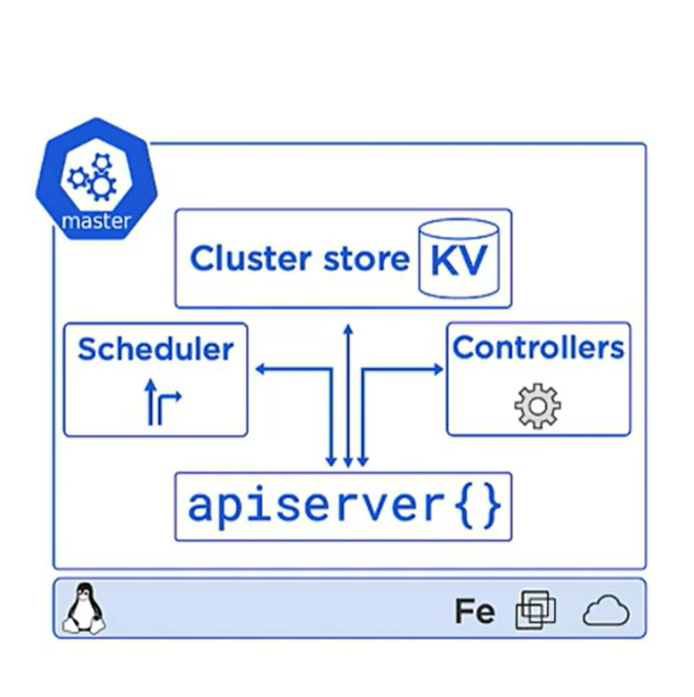

> **Nota para el instructor:** Explicar que etcd usa consenso Raft (igual que Swarm internamente), pero en K8s es un componente explícito que puedes gestionar.

### Worker Nodes

| Componente | Función | Equivalente en Swarm |
|-----------|---------|---------------------|
| **kubelet** | Agente que ejecuta pods | Docker daemon + agent |
| **kube-proxy** | Reglas de red (iptables/IPVS) | Routing mesh |
| **Container Runtime** | docker, containerd, cri-o | Docker engine |

---

## 4. Objetos Principales (~15 min)

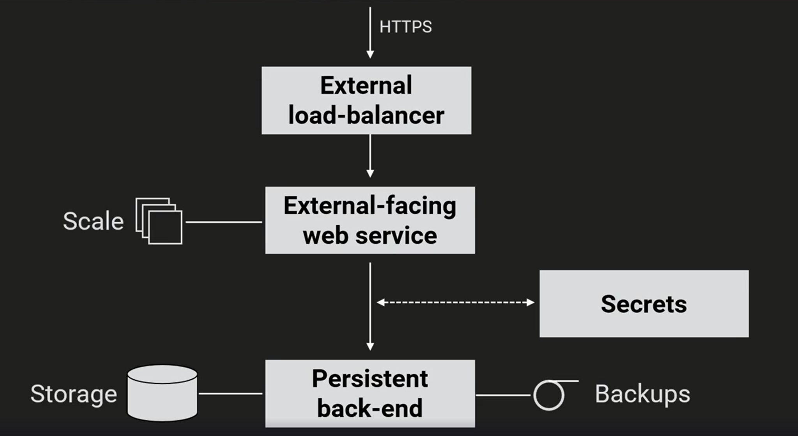

| Objeto | Descripción | Equivalente en Swarm |
|--------|-------------|---------------------|
| **Pod** | 1+ contenedores, unidad mínima | Task (un contenedor) |
| **Deployment** | Gestiona réplicas, rolling updates | Service |
| **Service** | IP estable + DNS + load balancing | Service VIP |
| **Namespace** | Aislamiento lógico | N/A (Swarm no tiene) |
| **Secret/ConfigMap** | Configuración y secretos | Docker secrets/configs |
| **Volume** | Almacenamiento persistente | Docker volumes |

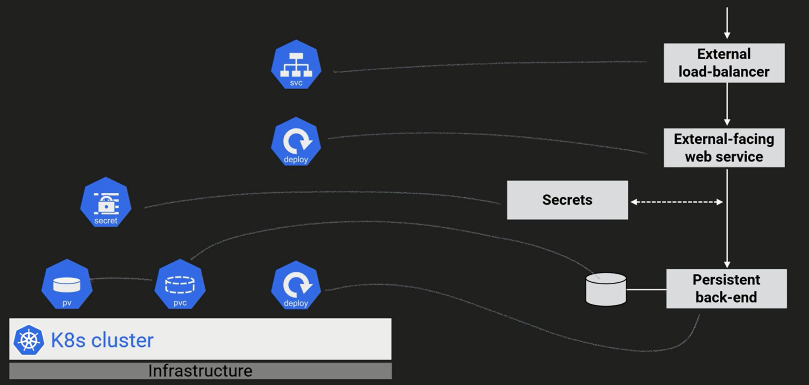

**Diferencia clave Pod vs Container:**
- En Swarm: 1 task = 1 contenedor
- En K8s: 1 pod = 1+ contenedores que comparten red y almacenamiento
- Caso típico: sidecar patterns (proxy, logging, etc.)

---

## 5. Redes en Kubernetes (~20 min)

### De monolítico a microservicios

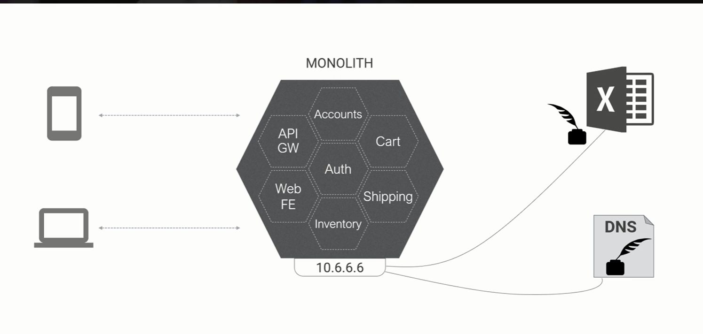

> "En una app monolítica no te preocupas por networking."

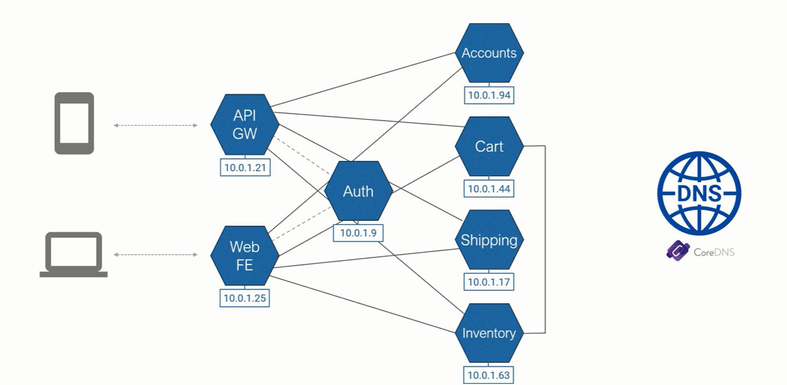

> "Con contenedores todo cambia: Dynamic Network / Service Discovery"

### Modelo de Red en K8s

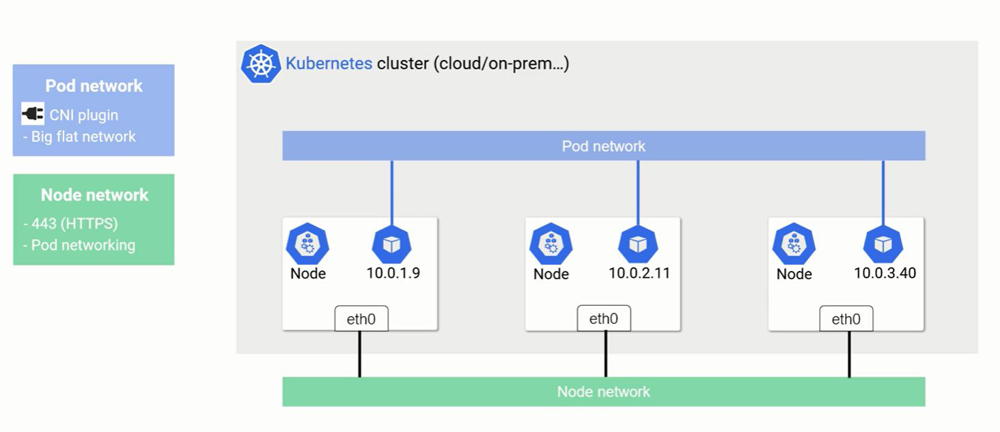

Reglas fundamentales:
1. **Flat network** — todos los pods se ven entre sí sin NAT
2. Cada pod tiene su propia IP
3. La red es software (CNI plugins): Calico, Flannel, Cilium, etc.

**vs Swarm:** En Swarm usas overlay networks explícitas. En K8s la red plana es el default.

### Servicios y Service Discovery

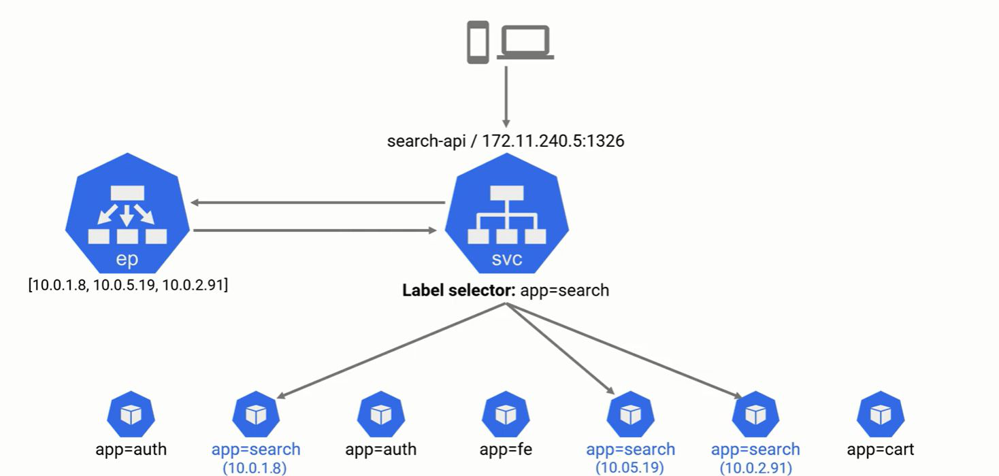

- Pods son efímeros → no usar IPs directamente
- **Services** proporcionan IP estable + nombre DNS
- Cada pod puede resolver servicios vía DNS (`mi-servicio.mi-namespace.svc.cluster.local`)

**Esto ya lo conocéis de Swarm** (VIP + DNS interno), K8s lo hace igual pero con más opciones.

### Tipos de Service

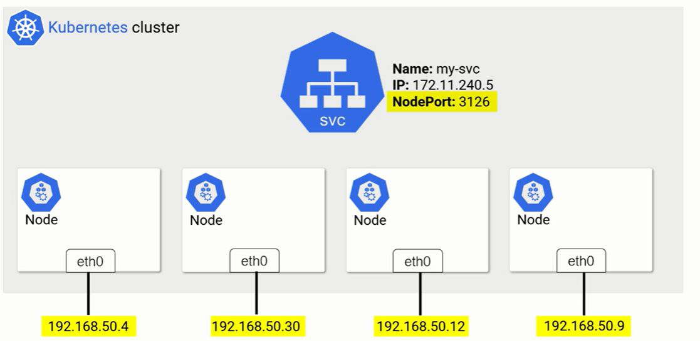

| Tipo | Acceso | Equivalente Swarm |
|------|--------|------------------|
| **ClusterIP** | Solo interno al clúster | VIP interna |
| **NodePort** | Puerto en cada nodo (30000-32767) | Published port |
| **LoadBalancer** | IP externa (cloud) | N/A |

### Service Network

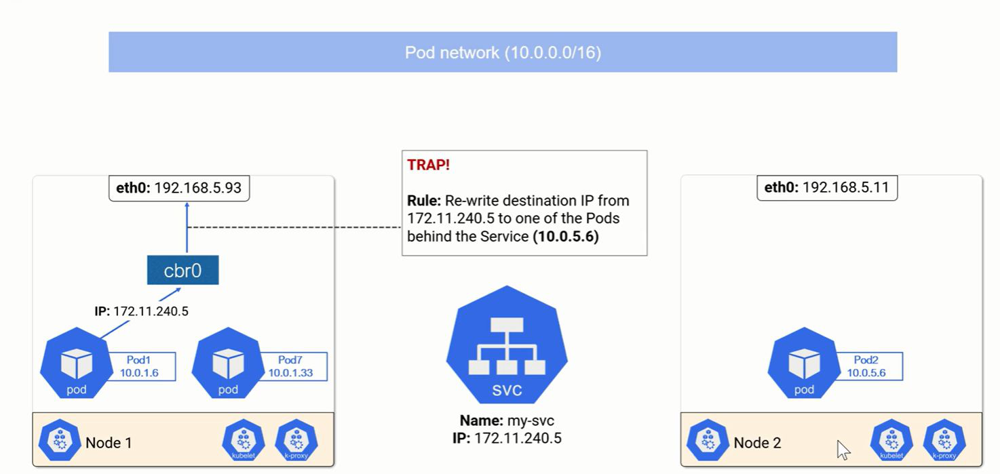

- Los Services no tienen interfaz de red física
- kube-proxy gestiona reglas iptables/IPVS en cada nodo
- El tráfico se rutea al pod correcto

---

## 6. Almacenamiento (~10 min)

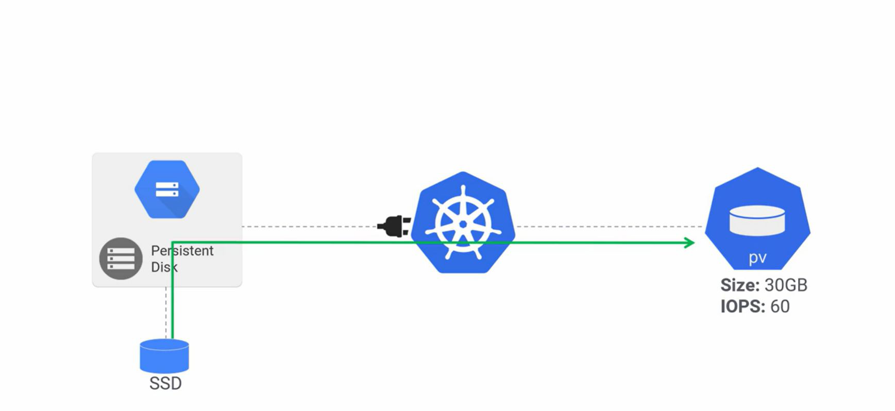

| Concepto | Descripción | Equivalente Swarm |
|----------|-------------|------------------|
| **Volume** | Abstracción de almacenamiento | Docker volume |
| **PersistentVolume (PV)** | Recurso de almacenamiento (disco) | Volume driver |
| **PersistentVolumeClaim (PVC)** | "Ticket" para solicitar un PV | N/A |

**Diferencia clave:** En Swarm montas volúmenes directamente. En K8s hay una capa de abstracción (PV/PVC) que permite provisioning dinámico y portabilidad.

---

## 7. Namespaces (~10 min)

- Cluster virtual que agrupa objetos
- Nombre único dentro del clúster
- Resource Quotas por namespace
- **Swarm no tiene equivalente** → esto es nuevo para los alumnos

Casos de uso:
- Separar entornos (dev/staging/prod) en un solo clúster
- Aislar equipos/proyectos
- Limitar recursos por equipo

---

## 8. Resumen y Transición (~10 min)

**Tabla resumen para cerrar:**

| Aspecto | Docker Swarm | Kubernetes |
|---------|-------------|-----------|
| Complejidad | Baja | Media-Alta |
| Escalabilidad | Media | Alta |
| Ecosistema | Limitado | Enorme |
| Declarativo | docker-compose | YAML manifests |
| Networking | Overlay + VIP | CNI + Services + Ingress |
| Storage | Volumes | PV/PVC/StorageClass |
| Aislamiento | N/A | Namespaces + RBAC |
| Auto-healing | Sí (básico) | Sí (avanzado) |
| Auto-scaling | Manual | HPA/VPA/Cluster Autoscaler |

**Mensaje final:** "Kubernetes es más complejo que Swarm, pero ya tenéis los conceptos base. En los siguientes módulos vamos a hacer hands-on."

---

## Notas para el Instructor

- **No hacer demo práctica en este módulo.** Es puramente conceptual.
- Preguntar frecuentemente: "¿Cómo haríais esto en Swarm?" para anclar conceptos.
- Los diagramas están en `assets/` para proyectar o compartir pantalla.
- Si los alumnos preguntan por instalación, remitir al Módulo 3.
