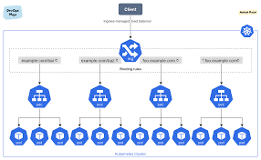

# Guía del Instructor — Introducción a Kubernetes

> **Audiencia:** Alumnos con experiencia en Docker y Docker Swarm.  
> **Duración:** ~2 horas.  
> **Enfoque:** Presentar K8s como evolución natural de lo que ya conocen.

---

## 1. Introducción a Kubernetes

### El Problema: ¿Por qué necesitamos esto?

> Imaginad que tenéis 50 contenedores Docker repartidos en 10 servidores. Es viernes a las 18:00. Uno de los servidores se cae. ¿Quién mueve los contenedores? ¿Quién avisa al load balancer? ¿Quién se queda el viernes?

Con Docker sabéis empaquetar apps. Con Swarm aprendisteis a distribuirlas. Pero en producción real aparecen problemas que Swarm resuelve "a medias":

- 🔥 Un nodo se cae → ¿quién redistribuye la carga *rápido*?
- 📈 Black Friday → ¿quién escala de 3 a 30 réplicas *automáticamente*?
- 🔄 Deploy de nueva versión → ¿cómo hacerlo con *cero downtime*?
- 🔒 Microservicio A no debería hablar con C → ¿quién controla eso?
- 💾 La base de datos necesita disco que *sobreviva* al contenedor → ¿cómo?

**Kubernetes resuelve todos estos problemas.** Y lo hace de forma declarativa: tú describes el estado deseado, K8s se encarga de mantenerlo.

### Origen: De Google al Mundo

| Año | Evento |
|-----|--------|
| **2003-2013** | Google ejecuta *billones* de contenedores/semana con sistemas internos: **Borg** y **Omega** |
| **2014** | Google libera Kubernetes como open-source (no es Borg, pero hereda sus ideas) |
| **Jul 2015** | Kubernetes v1.0 — donado a la CNCF (Cloud Native Computing Foundation) |
| **2017-2018** | AWS, Azure y GCP ofrecen K8s gestionado. Docker Inc. añade soporte nativo |
| **2020** | Docker Swarm pierde relevancia. K8s es el estándar de facto |
| **Hoy** | 96% de organizaciones usan o evalúan K8s (CNCF Survey 2023) |

### ¿Qué es Kubernetes en una frase?

> "Kubernetes es una plataforma portable y extensible de código abierto para administrar cargas de trabajo y servicios. Facilita la automatización y la configuración declarativa."

- 📦 **Orientada a contenedores** — todo es un contenedor
- 🧩 **Microservicios** — diseñada para apps distribuidas
- ☁️ **Híbrida / Multi-cloud** — funciona igual en cualquier sitio
- 🛠️ **Escrito en Go** — rápido, compilado, concurrente
- 🌍 **Comunidad masiva** — +3.500 contributors, mayor proyecto en GitHub después de Linux

### El nombre

**K8s** = K + 8 letras + s.


---

## 2. Conceptos Fundamentales

### ¿Qué es un Orquestador?

Ya sabéis lo que hace `docker run` en una máquina. Un orquestador hace lo mismo, pero a **escala de clúster**: decide dónde correr cada contenedor, los mantiene vivos, los escala, y gestiona su red y almacenamiento. Automáticamente.

En Swarm esto ya lo hacíais, pero de forma limitada. K8s lleva cada capacidad al siguiente nivel:

### Las 7 Capacidades de un Orquestador

| # | Capacidad | Ejemplo real | ¿Swarm lo hace? |
|---|-----------|-------------|-----------------|
| 1 | **Scheduling** — Decidir dónde ejecutar cada contenedor | "Este pod necesita 2GB RAM → va al nodo que tenga espacio" | ✅ Básico |
| 2 | **Auto-healing** — Recuperarse de fallos automáticamente | "El pod murió → reiniciar. El nodo cayó → mover pods a otro" | ✅ Básico |
| 3 | **Auto-scaling** — Escalar según demanda | "CPU al 80% → crear 5 réplicas más. Baja al 20% → reducir a 2" | ❌ Manual |
| 4 | **Service Discovery** — Encontrar servicios por nombre | `curl http://api-users:8080` → resuelve automáticamente | ✅ DNS |
| 5 | **Load Balancing** — Distribuir tráfico entre réplicas | "3 pods de nginx → repartir requests round-robin" | ✅ Routing mesh |
| 6 | **Rolling Updates** — Actualizar sin downtime | "Reemplazar v1.2 → v1.3 un pod a la vez, sin cortar tráfico" | ✅ Básico |
| 7 | **Declarative Config** — Describes QUÉ, no CÓMO | "Quiero 3 réplicas de nginx:1.25 con 512MB RAM" → K8s lo hace | ⚠️ Parcial |

### Declarativo vs Imperativo

| Imperativo (Docker/Swarm) | Declarativo (Kubernetes) |
|---------------------------|--------------------------|
| "Arranca 3 contenedores de nginx" | "Quiero que siempre haya 3 nginx" |
| `docker service create --replicas 3 nginx` | `kubectl apply -f deployment.yaml` |
| Dices **qué hacer** | Dices **cómo debe quedar** |
| Si uno muere, tú lo reinicias | Si uno muere, K8s lo recrea solo |
| El estado es "lo que pasó" | El estado es "lo que debería ser" |

> Kubernetes funciona con un **reconciliation loop**: compara constantemente el estado actual con el estado deseado. Si hay diferencia, actúa. Siempre. 24/7. Sin intervención humana.

### Traducción Swarm → K8s

| Docker Swarm | Kubernetes |
|-------------|-----------|
| `docker service create` | `kubectl apply -f deployment.yaml` |
| Stacks (compose) | Helm charts / manifiestos YAML |
| Swarm manager | Control Plane (API Server) |
| Swarm worker | Worker Node |
| Overlay network | CNI plugins (Calico, Flannel, Cilium) |
| Simple, integrado en Docker | Más complejo, más potente, más estándar |

---

## 3. Arquitectura del Clúster


### Control Plane (Master Node)

Equivalente al Swarm Manager, pero más componentes especializados:

| Componente | Función | Equivalente en Swarm |
|-----------|---------|---------------------|
| **kube-apiserver** | API REST, punto de entrada | Manager API |
| **etcd** | Almacén KV distribuido (estado del clúster) | Raft store interno |
| **kube-scheduler** | Decide dónde ejecutar pods | Scheduler integrado |
| **kube-controller-manager** | Mantiene el estado deseado | Reconciliation loop |
| **cloud-controller-manager** | Integración con proveedores cloud | N/A |


### Worker Nodes

| Componente | Función | Equivalente en Swarm |
|-----------|---------|---------------------|
| **kubelet** | Agente que ejecuta pods | Docker daemon + agent |
| **kube-proxy** | Reglas de red (iptables/IPVS) | Routing mesh |
| **Container Runtime** | docker, containerd, cri-o | Docker engine |

---

## 4. Objetos Principales


| Objeto | Descripción | Equivalente en Swarm |
|--------|-------------|---------------------|
| **Pod** | 1+ contenedores, unidad mínima | Task (un contenedor) |
| **Deployment** | Gestiona réplicas, rolling updates | Service |
| **Service** | IP estable + DNS + load balancing | Service VIP |
| **Namespace** | Aislamiento lógico | N/A (Swarm no tiene) |
| **Secret/ConfigMap** | Configuración y secretos | Docker secrets/configs |
| **Volume** | Almacenamiento persistente | Docker volumes |


**Diferencia clave Pod vs Container:**
- En Swarm: 1 task = 1 contenedor
- En K8s: 1 pod = 1+ contenedores que comparten red y almacenamiento
- Caso típico: sidecar patterns (proxy, logging, etc.)

---

## 4b. Metadatos de Objetos: Labels, Annotations y Scheduling

### Labels (Etiquetas)

Las **labels** son pares clave-valor que se asignan a cualquier objeto de Kubernetes. Son el mecanismo fundamental para **organizar, seleccionar y agrupar** recursos.

```yaml
metadata:
  labels:
    app: frontend
    env: production
    team: payments
    version: v2.1.0
```

**¿Para qué sirven?**

| Uso | Ejemplo |
|-----|---------|
| **Selección** | Un Service encuentra sus pods por labels (`selector: app=frontend`) |
| **Agrupación** | Filtrar pods por entorno: `kubectl get pods -l env=production` |
| **Scheduling** | NodeAffinity usa labels de nodos para decidir dónde ejecutar pods |
| **Organización** | Etiquetar por equipo, proyecto, versión, capa (frontend/backend) |

**Convenciones recomendadas:**

| Label | Descripción |
|-------|-------------|
| `app.kubernetes.io/name` | Nombre de la aplicación |
| `app.kubernetes.io/version` | Versión |
| `app.kubernetes.io/component` | Componente (frontend, backend, db) |
| `app.kubernetes.io/part-of` | Proyecto/sistema al que pertenece |
| `app.kubernetes.io/managed-by` | Herramienta que lo gestiona (helm, kubectl) |

**Selectors — el poder de las labels:**

Los selectores permiten a otros objetos "encontrar" recursos por sus labels:

```yaml
# Un Service selecciona pods con estas labels
spec:
  selector:
    app: frontend
    env: production
```

```bash
# Desde CLI
kubectl get pods -l app=frontend
kubectl get pods -l 'env in (production, staging)'
kubectl get pods -l app=frontend,version!=v1.0
kubectl delete pods -l env=test    # ¡Cuidado! Borra todos los pods de test
```

> **Equivalencia Swarm:** En Swarm podéis filtrar nodos con `--constraint node.labels.zone==eu-west`. En K8s las labels son universales: se usan en pods, nodos, services, namespaces, y cualquier otro objeto.

### Annotations (Anotaciones)

Las **annotations** también son pares clave-valor, pero su propósito es diferente: almacenan **metadatos informativos** que NO se usan para selección.

```yaml
metadata:
  annotations:
    description: "API de pagos para marketplace"
    contact: "team-payments@empresa.com"
    git-commit: "a1b2c3d"
    prometheus.io/scrape: "true"
    prometheus.io/port: "9090"
    nginx.ingress.kubernetes.io/rewrite-target: /
```

**Labels vs Annotations:**

| Aspecto | Labels | Annotations |
|---------|--------|-------------|
| **Propósito** | Identificar y seleccionar | Informar y configurar |
| **Se pueden usar en selectors** | ✅ Sí | ❌ No |
| **Tamaño** | Limitado (63 chars valor) | Hasta 256KB |
| **Ejemplo** | `app: nginx` | `description: "Web server para..."` |
| **Quién las usa** | K8s internamente (Services, Deployments) | Herramientas externas (Prometheus, Ingress, CI/CD) |

> **Regla simple:** Si necesitas filtrar o seleccionar por ese dato → **label**. Si es información descriptiva o configuración para herramientas → **annotation**.

### NodeSelector y NodeAffinity (Scheduling avanzado)

Por defecto, el scheduler de K8s decide dónde ejecutar cada pod basándose en recursos disponibles. Pero a veces necesitas **control explícito**: ejecutar ciertos pods solo en nodos con GPU, en una zona geográfica concreta, o en nodos con SSD.

#### Labels en Nodos

Los nodos también tienen labels. Algunos vienen predefinidos:

```bash
kubectl get nodes --show-labels

# Labels automáticas:
# kubernetes.io/hostname=worker-1
# kubernetes.io/os=linux
# kubernetes.io/arch=amd64
# topology.kubernetes.io/zone=eu-west-1a

# Labels personalizadas:
kubectl label nodes worker-1 disk=ssd
kubectl label nodes worker-2 disk=hdd
kubectl label nodes worker-1 gpu=nvidia
```

#### nodeSelector (simple)

La forma más sencilla de restringir dónde corre un pod:

```yaml
spec:
  nodeSelector:
    disk: ssd        # Solo en nodos con label disk=ssd
```

Es un AND estricto: si ningún nodo cumple, el pod queda en **Pending** indefinidamente.

#### nodeAffinity (avanzado)

Más flexible que `nodeSelector`. Permite expresiones complejas y distingue entre **obligatorio** y **preferente**:

```yaml
spec:
  affinity:
    nodeAffinity:
      # OBLIGATORIO: el pod NO se ejecuta si no se cumple
      requiredDuringSchedulingIgnoredDuringExecution:
        nodeSelectorTerms:
        - matchExpressions:
          - key: disk
            operator: In
            values: ["ssd"]
      # PREFERENTE: el scheduler lo intenta, pero no es bloqueante
      preferredDuringSchedulingIgnoredDuringExecution:
      - weight: 80
        preference:
          matchExpressions:
          - key: topology.kubernetes.io/zone
            operator: In
            values: ["eu-west-1a"]
```

**Operadores disponibles:**

| Operador | Significado |
|----------|-------------|
| `In` | El valor de la label está en la lista |
| `NotIn` | El valor NO está en la lista |
| `Exists` | La label existe (sin importar el valor) |
| `DoesNotExist` | La label NO existe |
| `Gt` / `Lt` | Mayor / Menor que (para valores numéricos) |

**Tipos de affinity:**

| Tipo | Comportamiento |
|------|---------------|
| `requiredDuringSchedulingIgnoredDuringExecution` | **Obligatorio.** Si no hay nodo que cumpla → pod Pending |
| `preferredDuringSchedulingIgnoredDuringExecution` | **Preferente.** Si no hay nodo ideal, se coloca donde pueda |

> **"IgnoredDuringExecution"** significa que si un nodo pierde la label después de que el pod ya esté corriendo, el pod NO se mueve. Solo afecta al scheduling inicial.

#### Resumen Scheduling

| Mecanismo | Complejidad | Uso |
|-----------|-------------|-----|
| Sin especificar | — | El scheduler decide (por recursos) |
| `nodeSelector` | Baja | Restricción simple por una label |
| `nodeAffinity` (required) | Media | Restricción obligatoria con operadores |
| `nodeAffinity` (preferred) | Media | Preferencia con pesos (soft constraint) |
| Taints + Tolerations | Alta | "Repeler" pods de ciertos nodos |

#### Taints y Tolerations (detallado)

Los *taints* permiten "repeler" pods de nodos; las *tolerations* permiten que un pod sea programado en nodos con ciertos taints.

Ejemplo: aplicar un taint a un nodo (desde la máquina del instructor):

```bash
kubectl taint nodes worker-1 dedicated=db:NoSchedule
```

Efectos principales:
- `NoSchedule`: el scheduler no programará pods sin la toleration correspondiente.
- `PreferNoSchedule`: el scheduler evitará el nodo cuando sea posible.
- `NoExecute`: además de evitar, expulsará pods que no toleren el taint.

Ejemplo de toleration en un Pod:

```yaml
spec:
  tolerations:
  - key: "dedicated"
    operator: "Equal"
    value: "db"
    effect: "NoSchedule"
```

Ejemplos prácticos y manifiestos
- Consulta `modulo-01-introduccion/ejemplos/` para manifests listos: `node-selector.yaml`, `node-affinity-required.yaml`, `node-affinity-preferred.yaml`, `taint-toleration.yaml`, `daemonset-tolerations.yaml`.
- Pasos sugeridos para practicar:
  1. Etiquetar nodos: `kubectl label nodes <node> disk=ssd`
  2. Aplicar taint: `kubectl taint nodes <node> dedicated=db:NoSchedule`
  3. Desplegar `taint-toleration.yaml` y observar `kubectl get pods -o wide` y `kubectl describe pod <pod>` para diagnosticar scheduling.

> **Caso real:** "Los pods de base de datos deben correr en nodos con disco SSD (`required`). Los pods del frontend preferiblemente en la zona eu-west-1a (`preferred`, weight 80), pero si no hay capacidad pueden ir a otra zona."

---

## 5. Despliegues

En Swarm tenéis `docker service create` para desplegar contenedores con réplicas. En K8s existen **tres controladores** según el tipo de carga de trabajo:

### Deployments (Stateless)

El equivalente directo a un **Service de Swarm**. Gestiona réplicas de pods sin estado.

| Capacidad | Swarm | Kubernetes Deployment |
|-----------|-------|-----------------------|
| Réplicas | `--replicas 3` | `replicas: 3` en el manifiesto |
| Actualización gradual | `--update-delay 10s` | `strategy: RollingUpdate` (configurable) |
| Rollback | `docker service rollback` | `kubectl rollout undo` (historial completo) |
| Auto-scaling | ❌ Manual | ✅ HPA (CPU/memoria/métricas custom) |

### DaemonSets (Un pod por nodo)

Garantiza que **un pod corra en cada nodo** del clúster. Cuando se añade un nodo, el DaemonSet despliega automáticamente el pod en él.

| Caso de uso | Ejemplo |
|-------------|---------|
| Logging | Fluentd/Filebeat recolectando logs en cada nodo |
| Monitoreo | Node Exporter (Prometheus) en todos los nodos |
| Networking | Agentes de CNI, mesh sidecars |

> **Equivalente Swarm:** `docker service create --mode global` → ejecuta una tarea en cada nodo. El DaemonSet es el mismo concepto pero con más control (tolerations, node selectors).

### StatefulSets (Con estado)

Para aplicaciones que necesitan **identidad estable** y **almacenamiento persistente por pod**. A diferencia de un Deployment, los pods no son intercambiables.

| Deployment | StatefulSet |
|------------|-------------|
| Pods con nombres aleatorios (deploy-7f8b4-xk2p) | Pods con nombres ordenados (mysql-0, mysql-1, mysql-2) |
| Sin almacenamiento por pod | Cada pod tiene su propio PVC |
| Se pueden escalar en cualquier orden | Escalado/actualización secuencial |
| Ideal: APIs, web servers | Ideal: bases de datos, colas, caches |

### Resumen rápido

| Controlador | ¿Cuándo usarlo? |
|-------------|-----------------|
| **Deployment** | Apps sin estado (APIs, frontends, workers) |
| **DaemonSet** | Agentes que deben correr en todos los nodos |
| **StatefulSet** | Apps con estado (BBDDs, clusters distribuidos) |

---

## 6. Redes en Kubernetes

### De monolítico a microservicios


> "En una app monolítica no te preocupas por networking."


> "Con contenedores todo cambia: Dynamic Network / Service Discovery"

### Modelo de Red en K8s


Reglas fundamentales:
1. **Flat network** — todos los pods se ven entre sí sin NAT
2. Cada pod tiene su propia IP
3. La red es software (CNI plugins): Calico, Flannel, Cilium, etc.

**vs Swarm:** En Swarm usas overlay networks explícitas. En K8s la red plana es el default.

### Servicios y Service Discovery


- Pods son efímeros → no usar IPs directamente
- **Services** proporcionan IP estable + nombre DNS
- Cada pod puede resolver servicios vía DNS (`mi-servicio.mi-namespace.svc.cluster.local`)

**Esto ya lo conocéis de Swarm** (VIP + DNS interno), K8s lo hace igual pero con más opciones.

### Tipos de Service


| Tipo | Acceso | Equivalente Swarm |
|------|--------|------------------|
| **ClusterIP** | Solo interno al clúster | VIP interna |
| **NodePort** | Puerto en cada nodo (30000-32767) | Published port |
| **LoadBalancer** | IP externa (cloud) | N/A |

### Service Network


- Los Services no tienen interfaz de red física
- kube-proxy gestiona reglas iptables/IPVS en cada nodo
- El tráfico se rutea al pod correcto

### Ingress: Exponiendo servicios al exterior con inteligencia



**El problema:** `NodePort` expone un puerto por servicio (limitado a 30000-32767). `LoadBalancer` crea un balanceador externo por cada servicio (caro en cloud). ¿Y si tengo 20 microservicios que quiero exponer por HTTP/HTTPS con dominios y paths distintos?

**La solución: Ingress** — un objeto que define reglas de enrutamiento HTTP/HTTPS a nivel de capa 7 (aplicación).

| Concepto | Descripción |
|----------|-------------|
| **Ingress** | Recurso declarativo que define reglas de enrutamiento (host, path → Service) |
| **Ingress Controller** | Componente que implementa esas reglas (nginx, HAProxy, Traefik, Envoy…) |

> **Analogía Swarm:** En Swarm usabais Traefik o nginx-proxy como reverse proxy manual. En K8s, Ingress **estandariza** ese patrón como objeto nativo del API.

#### ¿Cómo funciona?

1. Despliegas un **Ingress Controller** (es un pod que corre un reverse proxy)
2. Creas recursos **Ingress** que declaran las reglas
3. El controller lee esas reglas y configura su proxy automáticamente
4. El tráfico externo llega al controller → se enruta al Service correcto → llega a los pods

#### Ejemplo de recurso Ingress

apiVersion: networking.k8s.io/v1
kind: Ingress
metadata:
  name: mi-app-ingress
  annotations:
    nginx.ingress.kubernetes.io/rewrite-target: /
spec:
  ingressClassName: nginx
  rules:
  - host: api.miempresa.com
    http:
      paths:
      - path: /usuarios
        pathType: Prefix
        backend:
          service:
            name: svc-usuarios
            port:
              number: 8080
      - path: /pedidos
        pathType: Prefix
        backend:
          service:
            name: svc-pedidos
            port:
              number: 8080
  - host: admin.miempresa.com
    http:
      paths:
      - path: /
        pathType: Prefix
        backend:
          service:
            name: svc-admin
            port:
              number: 3000
  tls:
  - hosts:
    - api.miempresa.com
    - admin.miempresa.com
    secretName: mi-tls-secret

> Con un solo punto de entrada, enrutamos tráfico a 3 servicios distintos basándonos en el host y el path. Además, TLS se gestiona de forma centralizada.

#### Ingress según el entorno

| Entorno | Ingress Controller típico | ¿Cómo llega el tráfico al controller? | Notas |
|---------|--------------------------|---------------------------------------|-------|
| **Kind** | ingress-nginx (deploy manual) | El controller se expone con `hostPort` o `extraPortMappings` en la config de Kind | Requiere configuración especial en el manifiesto de creación del clúster Kind (`extraPortMappings` para mapear puertos 80/443 del host al nodo) |
| **Vanilla K8s (kubeadm, bare-metal)** | ingress-nginx, Traefik, HAProxy | El controller se despliega como `DaemonSet` o `Deployment` con `hostNetwork: true` o un Service `NodePort`/`LoadBalancer` (MetalLB) | Sin cloud, necesitas MetalLB o similar para simular un LoadBalancer. Alternativa: `NodePort` + DNS apuntando a los nodos |
| **OpenShift** | **Router (HAProxy)** — preinstalado | OpenShift usa **Routes** en lugar de Ingress (concepto anterior que inspiró Ingress). Soporta Ingress también, pero lo traduce a Routes internamente | Las Routes soportan TLS edge/passthrough/reencrypt, sticky sessions, y blue-green/canary nativo. El Router escucha en puertos 80/443 de nodos infra |
| **Cloud (EKS/GKE/AKS)** | AWS ALB Controller, GCE Ingress, Azure AGIC | Se provisiona automáticamente un Load Balancer del cloud provider al crear el Ingress | Cada Ingress puede crear un ALB/NLB (AWS), HTTP(S) LB (GCP), o Application Gateway (Azure). Integración nativa con certificados del cloud |

#### Kind: configuración especial

# Manifiesto de creación del clúster Kind
kind: Cluster
apiVersion: kind.x-k8s.io/v1alpha4
nodes:
- role: control-plane
  kubeadmConfigPatches:
  - |
    kind: InitConfiguration
    nodeRegistration:
      kubeletExtraArgs:
        node-labels: "ingress-ready=true"
  extraPortMappings:
  - containerPort: 80
    hostPort: 80
    protocol: TCP
  - containerPort: 443
    hostPort: 443
    protocol: TCP

Después se instala el controller:
kubectl apply -f https://raw.githubusercontent.com/kubernetes/ingress-nginx/main/deploy/static/provider/kind/deploy.yaml

#### OpenShift: Routes vs Ingress

# Route nativa de OpenShift (equivalente a Ingress)
apiVersion: route.openshift.io/v1
kind: Route
metadata:
  name: mi-app-route
spec:
  host: app.apps.mi-cluster.example.com
  to:
    kind: Service
    name: mi-servicio
    weight: 100
  port:
    targetPort: 8080
  tls:
    termination: edge
    insecureEdgeTerminationPolicy: Redirect

#### Resumen Ingress

- **Sin Ingress:** 1 LoadBalancer por servicio → caro y difícil de gestionar
- **Con Ingress:** 1 punto de entrada → reglas inteligentes L7 → N servicios
- Es el equivalente a un **reverse proxy automatizado** por Kubernetes
- El Ingress Controller es un componente que hay que instalar (no viene por defecto en vanilla K8s)

---

## 7. Almacenamiento


| Concepto | Descripción | Equivalente Swarm |
|----------|-------------|------------------|
| **Volume** | Abstracción de almacenamiento | Docker volume |
| **PersistentVolume (PV)** | Recurso de almacenamiento (disco) | Volume driver |
| **PersistentVolumeClaim (PVC)** | "Ticket" para solicitar un PV | N/A |

**Diferencia clave:** En Swarm montas volúmenes directamente. En K8s hay una capa de abstracción (PV/PVC) que permite provisioning dinámico y portabilidad.

---

## 8. Namespaces

- Cluster virtual que agrupa objetos
- Nombre único dentro del clúster
- Resource Quotas por namespace
- **Swarm no tiene equivalente** → esto es nuevo para los alumnos

Casos de uso:
- Separar entornos (dev/staging/prod) en un solo clúster
- Aislar equipos/proyectos
- Limitar recursos por equipo

---

## 9. Migración de Docker Swarm a Kubernetes

> "Ya sabéis que K8s es más potente que Swarm. Ahora la pregunta es: ¿cómo migráis lo que ya tenéis en Swarm sin romper producción?"

### Estrategia de Migración Incremental

1. **Inventariar** — Listar todos los servicios Swarm, sus dependencias, volúmenes y secrets
2. **Priorizar** — Empezar por workloads stateless y no críticos (frontends, APIs internas)
3. **Convertir** — Traducir compose/stacks a manifiestos K8s (manual o con herramientas)
4. **Validar en staging** — Probar en un namespace de prueba antes de producción
5. **Migrar datos** — Planificar la migración de volúmenes/BBDD (lo más delicado)
6. **Cutover** — Cambiar DNS/tráfico al clúster K8s
7. **Decommission** — Apagar Swarm cuando todo funcione

### Mapeo Detallado de Conceptos

| Docker Swarm | Kubernetes | Notas |
|---|---|---|
| `docker service create` | `Deployment` + `Service` | En K8s son dos objetos separados |
| `docker stack deploy -c compose.yml` | `kubectl apply -f` o `helm install` | Helm = compose con esteroides |
| `docker secret create` | `Secret` | K8s añade RBAC y encryption at-rest |
| `docker config create` | `ConfigMap` | Mismo concepto, más flexible |
| Overlay networks | CNI + NetworkPolicies | K8s usa red plana + políticas explícitas |
| `--mode global` | `DaemonSet` | Un pod por nodo |
| `--replicas N` | `Deployment` con `replicas: N` | Idéntico concepto |
| Published ports | `Service` (NodePort/LoadBalancer) o `Ingress` | Ingress es más potente que puertos expuestos |
| Health checks en compose | `livenessProbe` / `readinessProbe` | K8s separa "está vivo" de "puede recibir tráfico" |
| Volúmenes nombrados | `PersistentVolumeClaim` | Abstracción PV/PVC para portabilidad |
| `docker service scale` | `kubectl scale` o HPA | K8s puede escalar automáticamente |

### Herramienta: Kompose

Convierte `docker-compose.yml` a manifiestos K8s automáticamente:

# Instalación
brew install kompose   # macOS
# o: curl -L https://github.com/kubernetes/kompose/releases/latest/download/kompose-linux-amd64 -o kompose

# Conversión básica
kompose convert -f docker-compose.yml

# Genera: deployment.yaml + service.yaml por cada servicio del compose

**Limitaciones de Kompose** (explicar):
- No genera Ingress (hay que añadirlo manualmente)
- Los health checks se pierden o se traducen incorrectamente
- Los volúmenes nombrados se convierten en PVCs pero sin StorageClass
- No gestiona secrets de forma segura (los pone como env vars)
- Es un punto de partida, NO el resultado final

> **Recomendación:** Usar Kompose para el primer borrador, luego ajustar manualmente.

### Buenas Prácticas

| Práctica | Por qué |
|----------|---------|
| Migrar incrementalmente | Reduce riesgo. Si algo falla, solo afecta a un servicio |
| Definir resource requests/limits | Swarm no los hereda; K8s los necesita para scheduling |
| Usar Ingress en vez de puertos | Más limpio, más seguro, TLS centralizado |
| Separar secrets del código | En Swarm muchos ponen secrets en el compose; en K8s usar objetos Secret |
| Probar rollbacks antes de migrar | Asegurar que `kubectl rollout undo` funciona correctamente |
| Documentar el mapping | Crear tabla "servicio Swarm → recurso K8s" para el equipo |

---

## 10. Resumen y Transición

**Tabla resumen para cerrar:**

| Aspecto | Docker Swarm | Kubernetes |
|---------|-------------|-----------|
| Complejidad | Baja | Media-Alta |
| Escalabilidad | Media | Alta |
| Ecosistema | Limitado | Enorme |
| Declarativo | docker-compose | YAML manifests |
| Networking | Overlay + VIP | CNI + Services + Ingress |
| Storage | Volumes | PV/PVC/StorageClass |
| Aislamiento | N/A | Namespaces + RBAC |
| Auto-healing | Sí (básico) | Sí (avanzado) |
| Auto-scaling | Manual | HPA/VPA/Cluster Autoscaler |

### Comparativa: Docker Swarm vs Kubernetes vs OpenShift

| Aspecto | Docker Swarm | Kubernetes | OpenShift |
|---------|-------------|-----------|-----------|
| **Curva de aprendizaje** | Baja. Si sabes Docker, sabes Swarm | Media-Alta. Muchos conceptos y objetos nuevos | Alta. K8s + capas adicionales de OpenShift |
| **Instalación** | Trivial (`docker swarm init`) | Compleja. Múltiples componentes (kubeadm, etcd, CNI) | Muy compleja. Requiere infraestructura específica (CoreOS/RHEL), operadores |
| **Actualizaciones** | Manuales, simples. Un nodo a la vez | Rolling updates nativas. Helm para gestionar versiones | OTA (Over-the-Air) gestionadas por el Cluster Version Operator |
| **Seguridad** | Básica. TLS mutual entre nodos, secrets encriptados | RBAC, Network Policies, Pod Security Standards. Configuración manual | Seguridad por defecto. SCCs, SELinux, RBAC estricto, OAuth integrado |
| **Redes** | Overlay networks (VXLAN). Routing mesh integrado | CNI plugins (Calico, Flannel, Cilium). Flexible pero requiere configuración | OpenShift SDN / OVN-Kubernetes. Preconfigured out-of-the-box |
| **Integración con almacenamiento** | Docker volumes. Limitado a plugins de volumen | PV/PVC/StorageClass. Amplio soporte (CSI drivers) | Igual que K8s + integración nativa con Red Hat storage (ODF) |
| **Ecosistema** | Limitado. Comunidad pequeña, en declive | Enorme. CNCF, miles de herramientas, estándar de la industria | Enterprise. Catálogo de operadores, pipelines CI/CD integrados (Tekton) |
| **Escalado** | Manual (`docker service scale`). Sin auto-scaling | HPA, VPA, Cluster Autoscaler. Escalado horizontal y vertical | Igual que K8s + Machine API para escalar infraestructura |
| **Ideal para** | Entornos pequeños, equipos con poca experiencia ops, desarrollo local | Producción multi-cloud, equipos DevOps, máxima flexibilidad | Empresas que necesitan soporte comercial, seguridad estricta, CI/CD integrado |

**Mensaje final:** "Kubernetes es más complejo que Swarm, pero ya tenéis los conceptos base. OpenShift añade una capa enterprise sobre K8s. En los siguientes módulos vamos a hacer hands-on."

